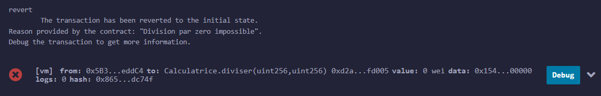
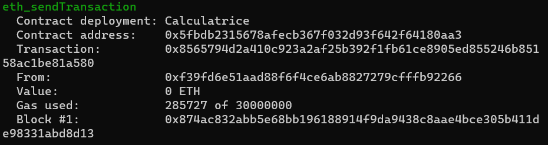

# Compte rendu TP Blockchain

1. Smart Contract Secret
2. Nouveau Smart Contract
3. Effectuer une transaction depuis une interface

## Smart Contract Secret

### Contrat
Voici ce que j'ai fait pour le Smart Contract Secret : 
```
// SPDX-License-Identifier: UNLICENSED
// Ce contrat permet à chaque utilisateur d'enregistrer et de récupérer un nombre, moyennant des frais de 100 gwei.

pragma solidity >=0.6.0 <0.9.0;

contract Secret {
    // Mapping qui associe chaque adresse d'utilisateur à un nombre
    mapping(address => uint) public userNumbers;

    // Fonction permettant à un utilisateur d'enregistrer un nombre
    function enregistrer(uint _nombre) public payable {
        // Vérifier que le montant envoyé avec la transaction est d'au moins 100 gwei
        require(msg.value >= 100 gwei, "Paiement insuffisant pour enregistrer");
        
        // Enregistrer le nombre associé à l'adresse de l'utilisateur
        userNumbers[msg.sender] = _nombre;

        // Transférer 100 gwei à l'utilisateur
        payable(msg.sender).transfer(100 gwei);
    }

    // Fonction permettant à un utilisateur de récupérer le nombre enregistré
    function recuperer() public payable returns (uint) {
        // Vérifier que le montant envoyé avec la transaction est d'au moins 100 gwei
        require(msg.value >= 100 gwei, "Paiement insuffisant pour récupérer");

        // Transférer 100 gwei à l'utilisateur
        payable(msg.sender).transfer(100 gwei);

        // Retourner le nombre enregistré associé à l'adresse de l'utilisateur
        return userNumbers[msg.sender];
    }
}
```
### Déploiement

On va utiliser les deux comptes suivants avec le contrat : 


On va déployer le contrat avec le premier et on va utiliser le contrat avec le second.

Avant de déployer, on compile le contrat : 
```
Successfully compiled: /c:/Users/aurel/TP/contracts/Secret.sol
```

En utilisant l'outil Remix, on peut déployer facilement le contrat :


Quand on déploie le contrat, on voit bien que ça coûte en gas puisque le nombre d'ethers du premier compte a diminué : 


### Utilisation du contrat

1. Enregistrer une valeur

Avec le deuxième compte, on effectue la transaction suivante (en veillant à mettre une value au message) : 


La transaction est effectuée avec succès : 


Voici les détails : 

```
status	0x1 Transaction mined and execution succeed
transaction hash	0x5e01bdd634302bdba683b82bfdb54b16f27e4a46f5f608ef72a6a0e2df3adf2b
block hash	0x6ed3629be6615a18ece26f633bfbf13c05129b16b70f081d9865e7ed0a8c76ce
block number	32
from	0x0A098Eda01Ce92ff4A4CCb7A4fFFb5A43EBC70DC
to	Secret.enregistrer(uint256) 0x2367298FFE28a551DDBa033ed2fE8769df5b00D8
gas	gas
transaction cost	50731 gas
execution cost	29527 gas
input	0xd9c...00015
decoded input	{ "uint256 _nombre": "21" }
decoded output	{}
logs	[]
val	400000000000 wei
```
  La sortie de la transaction indique que la transaction a été réussie avec un statut `0x1`, ce qui signifie que l'exécution du contrat s'est déroulée avec succès. La transaction a été incluse dans le bloc numéro 32 de la blockchain, identifiable par le hash du bloc `0x6ed3629be6615a18ece26f633bfbf13c05129b16b70f081d9865e7ed0a8c76ce`. L'expéditeur de la transaction est l'adresse `0x0A098Eda01Ce92ff4A4CCb7A4fFFb5A43EBC70DC` qui est donc bien le deuxième compte indiqué auparavant, et le contrat destinataire est identifié par l'adresse `0x2367298FFE28a551DDBa033ed2fE8769df5b00D8` et la fonction `enregistrer(uint256)` avec un paramètre `_nombre` de 21, ce qui correspond bien a ce qui a été inscrit. Le coût total de la transaction en gaz est de 50731, dont 29527 ont été utilisés pour l'exécution du contrat. La valeur de la transaction est de 400000000000 wei. La sortie décodée indique que la fonction n'a pas produit de sortie spécifique, et aucun journal d'événement n'a été émis lors de l'exécution de la transaction.

2. récupérer la valeur

Toujours avec le deuxième compte, on utilise la fonction recuperer du contrat pour récupérer le nombre qu'on a enregistré juste avant.
Voici les détails de la transaction : 
```
status	0x1 Transaction mined and execution succeed
transaction hash	0x97f918396d15b49da179270d38b004a28b47c9eb1d06c7146ee3fd27642f942a
block hash	0xdfbf384fbcb8b1bf7259b732836c6c22ee3eea5d83bd4851f8774ee368cc2fc7
block number	33
from	0x0A098Eda01Ce92ff4A4CCb7A4fFFb5A43EBC70DC
to	Secret.recuperer() 0x2367298FFE28a551DDBa033ed2fE8769df5b00D8
gas	gas
transaction cost	30486 gas
execution cost	9422 gas
input	0x872...f255e
decoded input	{}
decoded output	{ "0": "uint256: 21" }
logs	[]
val	400000000000 wei
```
On a un résultat similaire à ce qu'on a obtenu précédemment, sauf que cette fois l'input et vide et c'est l'output qui contient la vauleur 21, qui est bien la valeur qu'on avait enregistré précédemment. Le contrat fonctionne donc correctement.

3. Récupérer la valeur avec un autre utilisateur

Faisons un test en reprenant le premier compte (celui qui a déployé le contrat). On sélectionne ce compte et on appelle la fonction enregistrer.
Voici la sortie de la transaction : 
```
status	0x1 Transaction mined and execution succeed
transaction hash	0xf0897c9fe72b1c5dba939d7455dd72afa75f319358fa21b0fd82a2610d903496
block hash	0x21ed2d41bf5fd6c99354b0c9780735d1d9a19309df6e9d92dbb42f890b2862e3
block number	35
from	0x1aE0EA34a72D944a8C7603FfB3eC30a6669E454C
to	Secret.recuperer() 0x2367298FFE28a551DDBa033ed2fE8769df5b00D8
gas	gas
transaction cost	30486 gas
execution cost	9422 gas
input	0x872...f255e
decoded input	{}
decoded output	{ "0": "uint256: 0" }
logs	[]
```
Cette fois on peut voir que c'est le compte 0x1aE0EA34a72D944a8C7603FfB3eC30a6669E454C qui a appelé la fonction. En output, on a une valeur de 0, ce qui est normal puisqu'il s'agit de la valeur par défaut étant donné qu'aucun nombre n'avait été enregistré avec ce compte. Le contrat fonctionne donc bien, un utilisateur peut récupérer uniquement la valeur qu'il a enregistré.

## Nouveau Smart Contract

### Contrat

Pour le deuxième contrat, j'ai fait un simple contrat qui permet de faire des opérations de base (addition, soustraction, multiplication, division) : 
```
// SPDX-License-Identifier: UNLICENSED
pragma solidity >=0.6.0 <0.9.0;

contract Calculatrice {
    uint public resultat;

    // Fonction pour ajouter deux nombres et stocker le résultat
    function ajouter(uint a, uint b) public {
        resultat = a + b;
    }

    // Fonction pour soustraire b de a et stocker le résultat
    function soustraire(uint a, uint b) public {
        resultat = a - b;
    }

    // Fonction pour multiplier deux nombres et stocker le résultat
    function multiplier(uint a, uint b) public {
        resultat = a * b;
    }

    // Fonction pour diviser a par b, avec vérification pour éviter la division par zéro, et stocker le résultat
    function diviser(uint a, uint b) public {
        require(b != 0, "Division par zero impossible");
        resultat = a / b;
    }

    // Fonction pour réinitialiser la variable resultat à zéro
    function effacer() public {
        resultat = 0;
    }
}

```

Pour le déploiement du contrat, on le fait de la même manière que pour le preimer contrat.

### Utilisation du contrat

1. Addition

On appelle la fonction addition de cette façon : 


La transaction est effectuée avec succès : 
```
from	0x5B38Da6a701c568545dCfcB03FcB875f56beddC4
to	Calculatrice.resultat() 0xd2a5bC10698FD955D1Fe6cb468a17809A08fd005
execution cost	2446 gas (Cost only applies when called by a contract)
input	0xb4f...cf6bd
decoded input	{}
decoded output	{ "0": "uint256: 7" }
logs	[]
```
Pour l'output, on a bien 3+4 = 7, la fonction fonctionne bien


2. Soustraction

On appelle la fonction soustraction de cette façon :


La transaction est effectuée avec succès : 
```
from	0x5B38Da6a701c568545dCfcB03FcB875f56beddC4
to	Calculatrice.resultat() 0xd2a5bC10698FD955D1Fe6cb468a17809A08fd005
execution cost	2446 gas (Cost only applies when called by a contract)
input	0xb4f...cf6bd
decoded input	{}
decoded output	{ "0": "uint256: 4" }
logs	[]
```
Pour l'output, on a bien 9-5=4, la fonction fonctionne bien

3. Multiplication

On appelle la fonction multiplication de cette façon : 


La transaction est effectuée avec succès : 
```
from	0x5B38Da6a701c568545dCfcB03FcB875f56beddC4
to	Calculatrice.resultat() 0xd2a5bC10698FD955D1Fe6cb468a17809A08fd005
execution cost	2446 gas (Cost only applies when called by a contract)
input	0xb4f...cf6bd
decoded input	{}
decoded output	{ "0": "uint256: 64" }
logs	[]
```
Pour l'output, on a bien 8*8=64, la fonction fonctionne bien

4. Division

On appelle la fonction division de cette façon : 


La transaction est effectuée avec succès : 
```
from	0x5B38Da6a701c568545dCfcB03FcB875f56beddC4
to	Calculatrice.resultat() 0xd2a5bC10698FD955D1Fe6cb468a17809A08fd005
execution cost	2446 gas (Cost only applies when called by a contract)
input	0xb4f...cf6bd
decoded input	{}
decoded output	{ "0": "uint256: 3" }
logs	[]
```
Pour l'output, on a bien 15/5=3, la fonction fonctionne bien

5. Test de la division par 0

Vérifions ce qui se passe si on divise par 0 : 


On a alors une erreur, la transaction a échoué : 



Le contrat bloque donc une division par 0, il fonctionne correctement.

## Effectuer une transaction depuis une interface

J'ai essayé de créer une petite application web pour pouvoir interagir avec le contrat, je pense avoir réussit à faire une transaction mais je n'ai pas réussit à afficher la variable résultat. 
Le code se situe dans le fichier index.html.

Pour lancer l'application, il faut effectuer les commandes suivantes : 
```
npx hardhat node
npx live-server
```
Après avoir déployé le contrat et récupéré son adresse avec  :
```
npx hardhat run --network localhost scripts/deploy_calc.js
```
On peut alors voir le contrat déployé dans le terminal :



On arrive alors sur cette interface : 


Avant de l'utiliser, j'ai importé cet utilisateur (visible dans le npx hardhat node) dans MetaMask
```
#1: 0x70997970C51812dc3A010C7d01b50e0d17dc79C8 (10000 ETH)
Private Key: 0x59c6995e998f97a5a0044966f0945389dc9e86dae88c7a8412f4603b6b78690d
```
Je l'ai associé au réseau suivant pour qu'il se connecte à hardhat : 


L'utilisateur est alors bien connecté : 


Quand on appuie sur le bouton 'ajouter', une fenêtre MetaMask s'ouvre pour qu'on puisse valider la transaction : 


 Une fois validé, on a la confirmation que la transaction s'est bien effectué : 


 On peut également revoir la transaction en console : 


On peut aussi voir que l'utilisateur a payé pour sa transaction puisque son nombre d'ethers a diminué : 


